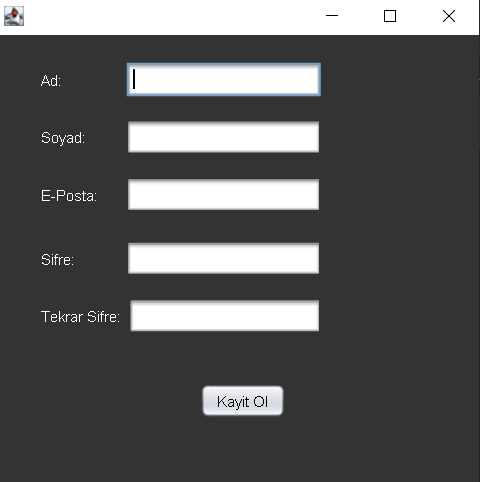
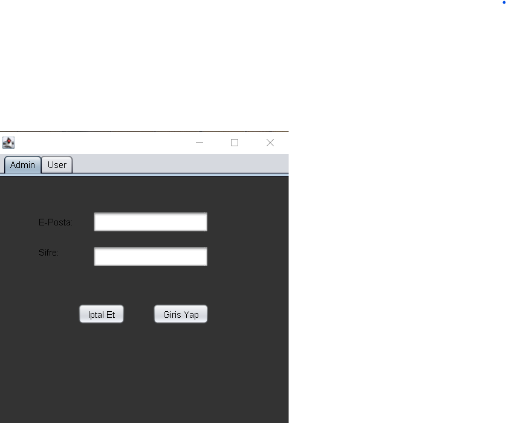
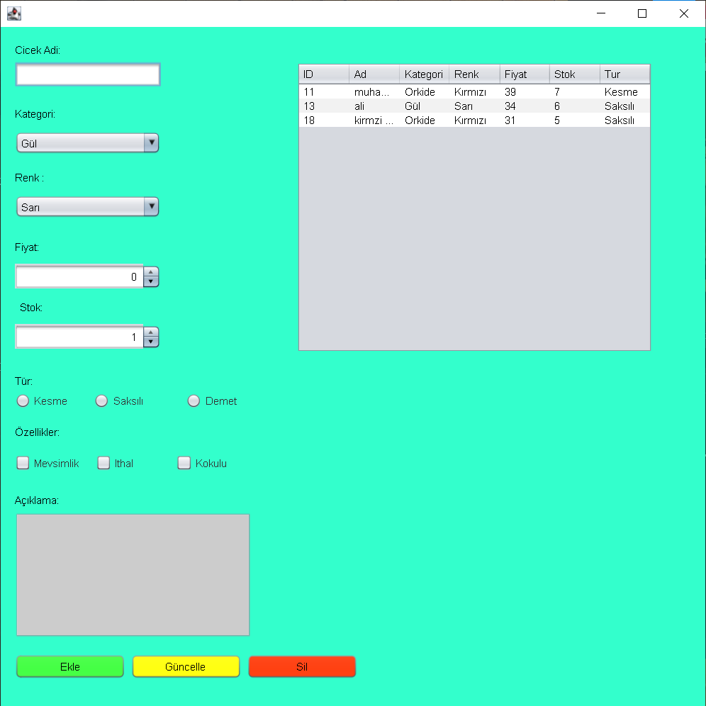
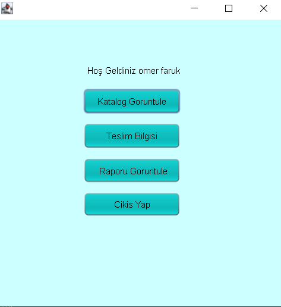
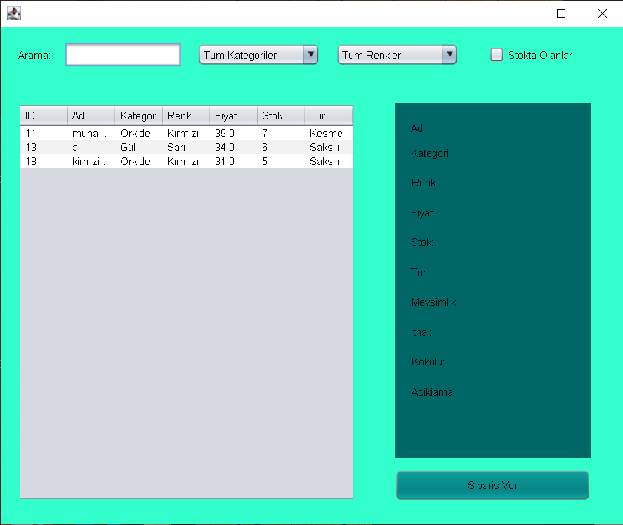
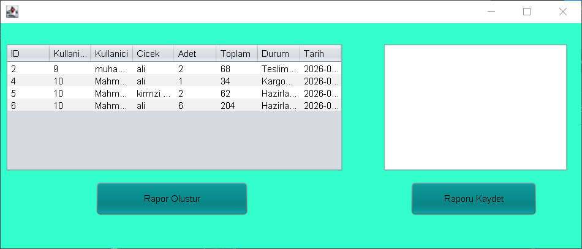

# Çiçek Sipariş ve Satış Sistemi

A Java Swing desktop application for managing flower orders and sales, built with MySQL database integration.

---

## Project Overview

This is a bilingual flower ordering and sales management system developed using Java Swing and MySQL. The application supports two user roles: **Admin** and **User**, each with different access levels and functionalities.

---

## Technologies Used

- **Language:** Java
- **UI Framework:** Java Swing
- **Database:** MySQL
- **Build Tool:** Maven
- **JDBC Driver:** mysql-connector-j 9.3.0

---

## Database Structure

**Database Name:** `cicek_sistemi`

| Table | Description |
|-------|-------------|
| `kullanicilar` | Stores user information (id, ad, soyad, eposta, sifre, bakiye, rol) |
| `cicekler` | Stores flower catalog (id, ad, kategori, renk, fiyat, stok, tur, mevsimlik, ithal, kokulu, aciklama) |
| `siparisler` | Stores order information (id, kullanici_id, cicek_id, adet, toplam_fiyat, teslimat_adresi, telefon, odeme_yontemi, hizli_teslimat, siparis_tarihi, durum) |

---

## Application Frames

### 1. Register Frame
Allows new users to create an account with validation rules.



---

### 2. Login Frame
Users and admins log in through separate tabs using JTabbedPane.



---

### 3. Çiçek Ekleme Düzenleme
Admin can add, update, and delete flowers from the catalog.



---

### 4. Ana Sayfa

Main menu for users to navigate to catalog, delivery info, order report and logout.



---

### 5. Katalog Görüntüleme
Users can browse the flower catalog with search and filter options.



---

### 6.Siparis Raporu
Admin can select orders from the table, generate a report and save it to a txt file.



---

## Project Requirements Checklist

| Requirement | Status |
|-------------|--------|
| ComboBox, CheckBox, RadioButton, JSpinner | |
| JTable and JList | |
| JTabbedPane | |
| At least 3 JOptionPane (2 different types) | |
| 4 Regular Expressions (Regex) | |
| Custom Exception class | |
| 2+ Database tables | |
| File read and write | |
| INSERT, DELETE, SELECT, UPDATE | |
| At least 6 frames | |
| Login and Register frames | |

---

## Regex Validations

| Field | Pattern |
|-------|---------|
| Password | At least 6 chars, 1 uppercase, 1 digit |
| Email | Standard email format |
| Phone | Must start with 05, 11 digits |
| Address | At least 10 characters |
| Flower Name | Letters only (Turkish + English) |

---

## File Operations

- **Admin** writes order reports to `siparis_raporu.txt` using `BufferedWriter`
- **User** reads their own orders from `siparis_raporu.txt` using `BufferedReader`
- Each line is tagged with `[kullanici_id:X]` for user-specific filtering

---

## Custom Exception

```java
public class SiparisException extends Exception {
    public SiparisException(String mesaj) {
        super(mesaj);
    }
}
```
Used in `AdminTeslimatBilgisi` when no order is selected before updating delivery status.

---

## How to Run

1. Make sure MySQL is running
2. Create the database using the SQL scripts provided
3. Run the JAR file: `BP2Proje2-1.0-SNAPSHOT.jar`
4. Login as Admin or User

**Admin credentials example:**
- Email: `admin@gmail.com`
- Password: `Admin123`

---

## Project Structure

```
BP2Proje2/
├── src/
│   └── main/java/com/mycompany/bp2proje2/
│       ├── Login.java
│       ├── Register.java
│       ├── AdminAnaSayfa.java
│       ├── UserAnaSayfa.java
│       ├── KatalogGörüntüleme.java
│       ├── SiparisOlusturma.java
│       ├── AdminTeslimatBilgisi.java
│       ├── UserTeslimatBilgisi.java
│       ├── AdminSiparisRaporu.java
│       ├── UserSipariRaporu.java
│       ├── ÇiçekEklemeDüzenleme.java
│       └── SiparisException.java
├── target/
│   └── BP2Proje2-1.0-SNAPSHOT.jar
├── screenshots/
└── pom.xml
```